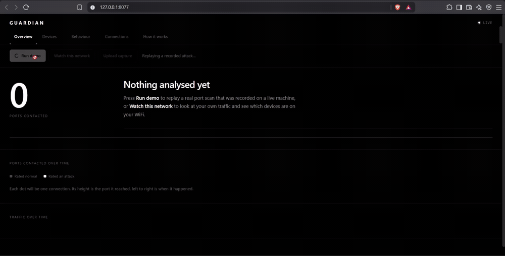

# Guardian

A network intrusion detector that captures live packets, groups them into flows, and
scores each flow with a random forest trained on CICIDS2017. It ships as a running
service with a web dashboard, not a notebook.

The interesting part is not the accuracy number. It is what happened when I pointed it
at a real attack.

<!-- TODO: replace with the deployed URL -->
**Live demo:** _not deployed yet_

<!-- TODO: add demo.gif showing the scan alert firing -->


## Quickstart

```bash
git clone https://github.com/harshpro02/network-security-ml.git
cd network-security-ml
python -m venv venv && venv\Scripts\activate
pip install -r requirements.txt
uvicorn src.api.main:app
```

Open http://127.0.0.1:8000. Press `run demo` to replay a recorded port scan, or
`upload capture` to score your own PCAP. Live capture needs
[Npcap](https://npcap.com/) and, on most systems, administrator rights.

## What it does

| Mode | Endpoint | Needs privileges | Works on a cloud host |
|---|---|---|---|
| Live capture | `GET /api/scan` | yes | no |
| Upload a PCAP | `POST /api/analyze` | no | yes |
| Replay a recording | `GET /api/demo` | no | yes |

Live capture is the point of the tool, and it is also why a hosted version can only do
so much: a cloud server has no traffic of its own worth watching. The hosted build
serves upload and replay, and says so on the page.

## Architecture

```
packets ──► flow table ──────► 4 features ──► binary detector ──► BENIGN / ATTACK
(scapy)     120s expiry        duration
            FIN/RST close      packets                └─► type classifier ──► named attack
                               bytes                      (precision-gated)
                               avg size

        └─► cross-flow window ──► distinct ports per source ──► behavioural alert
            (60s)                 distinct hosts per source
```

Two detectors, because they answer different questions.

The **model** judges one flow at a time. It is good at attacks with a distinctive shape:
floods, slow-loris style exhaustion, credential brute force.

The **cross-flow detector** judges the pattern across flows. It exists because some
attacks are invisible at flow level, which I found out the hard way.

The model itself is split in two. A binary detector produces the verdict. A separate
classifier names the attack type, but only for classes it was measured to be precise
on. That list is computed from the test set at training time and saved inside the model
bundle, so what gets served can never drift from what was measured.

## Results

Held-out 20% of a 500,000 row sample.

**Binary detector, the four features available live**

| | precision | recall | f1 |
|---|---|---|---|
| ATTACK | 0.926 | 0.980 | 0.953 |
| BENIGN | 0.995 | 0.981 | 0.988 |

Accuracy 0.9809, macro F1 0.9704, 3.1 MB on disk.

**Attack types reported by name** (precision at or above 0.80)

| type | precision |
|---|---|
| DDoS | 0.996 |
| PortScan | 0.990 |
| DoS slowloris | 0.984 |
| FTP-Patator | 0.958 |
| DoS Slowhttptest | 0.932 |
| DoS Hulk | 0.834 |

Bot, SSH-Patator, Heartbleed, Infiltration and the web attacks all score below 0.08
precision on these features. They are reported as generic threats and never named.

A reference model trained on all 78 CICIDS2017 columns reaches 0.9981 accuracy. It is
not deployed. Most of its features come from CICFlowMeter and cannot be computed from
raw packets in real time, and at 52 MB it does not belong in a repository.

## Testing it against a real attack

Every number above comes from CICIDS2017 rows. That is the same evidence almost every
project in this space stops at, so I wanted to know whether it held up.

`scripts/record_demo.py` runs a 1,024 port TCP connect scan against loopback, captures
it with this project's own code, and scores it. First run:

**0 of 2,050 scan flows detected.**

Three separate problems were hiding behind that.

### 1. Frame bytes instead of payload bytes

Median values for a single scanned port:

| | my capture | CICIDS2017 PortScan | CICIDS2017 BENIGN |
|---|---|---|---|
| total bytes | 56 | 0 | 66 |
| average packet size | 48 | 3 | 74.25 |

`flow_to_features` measured `len(packet)`, the whole frame including IP and TCP headers.
CICFlowMeter counts transport payload only, which is why a bare SYN is recorded as zero
bytes there. Every small flow was inflated by roughly a header, which put scan traffic
on top of the benign cluster rather than the PortScan cluster.

Switching to payload bytes is definitionally correct and measurably better. Detections
went from 0 to 3, the two named ones came back as PortScan, and false positives on real
benign captures went down rather than up.

### 2. A minimum packet threshold that discarded the evidence

Flows shorter than five packets were being skipped. Attack flows in CICIDS2017 have a
median of three packets and a 99th percentile of twelve. Checked against the training
data, that threshold was discarding 62% of all attack traffic and 99.9% of PortScan,
the class the model is most precise on.

Lowering it to one recovered all of that and produced one extra false positive across
1,000 packets of real benign capture.

### 3. Flows that never closed

CICFlowMeter expires a flow after 120 seconds or when TCP tears it down. My flow table
never closed anything, so a long conversation grew into a single enormous flow whose
duration and packet count resembled nothing in the training set. `FlowTable` now follows
the same rules.

### The part that was not a bug

After all three fixes it still only caught 3 of 2,050, and no amount of tuning was going
to change that. A single SYN to a closed port is four numbers: near zero duration, one
packet, zero bytes, zero average. A single benign packet is the same four numbers.
Nothing in a per-flow feature vector separates them.

What makes a scan a scan is that one host touched a thousand ports in a minute. That is
a property of the set of flows, not of any flow in it. The model was being asked a
question its inputs could not answer.

So I added a second detector that looks across flows. Counting distinct destination
ports per source per 60 second window, measured on every capture in this repository:

| capture | distinct ports per minute | verdict |
|---|---|---|
| port scan | **1,562** | alert |
| browsing | 3 | clean |
| video | 2 | clean |
| idle | 4 | clean |
| capture_001 | 1 | clean |

A threshold of 20 sits two orders of magnitude clear of normal traffic in both
directions. The dashboard reports these alerts separately from model verdicts, and says
which detector fired, because they are not the same kind of evidence.

This is roughly how production tooling works. Snort and Suricata run threshold rules
next to statistical detection rather than choosing one.

## Design decisions

**Scoping to four features.** The first live model was handed the 78 feature vector with
zeros in every slot that could not be measured from packets. It produced confident
nonsense. Retraining on only what is genuinely computable lowered the ceiling and made
the output mean something.

**Binary verdict, gated naming.** A 15 class model on four features looks acceptable on
accuracy at 0.926 and falls apart on precision. Bot scored 0.036, which is roughly 27
false alarms for every true one. Separating the verdict from the naming, and only naming
classes above a measured threshold, took macro F1 from 0.56 to 0.97.

**Model size.** Unlimited tree depth cost 83 MB and bought about one point of accuracy.
Depth capped and compressed, both models total 6.9 MB and live in the repository, so a
clone runs without a separate download.

**Batched inference.** Scoring called `predict()` once per flow at 45 ms each, which is
92 seconds for the 2,050 flows a port scan produces. One frame and one call does the
same work in 0.09 seconds.

## Known limitations

Stated plainly, because they are real.

- **The headline accuracy is optimistic.** The split is random, and CICIDS2017 attack
  flows arrive in bursts of near identical records, so near duplicates land on both
  sides of the split. A day held out evaluation is the honest test.
- **Test set precision does not survive contact with live traffic.** PortScan scores
  0.990 on held out rows and caught 3 of 2,050 flows on a scan this code captured. The
  cross-flow detector covers that case; the general lesson stands.
- **Four features is a low ceiling.** Around 28 CICIDS2017 columns are derivable from
  raw packets, including destination port, packet length statistics, inter-arrival times
  and TCP flag counts. Destination port alone takes accuracy to 0.9956 and macro F1 to
  0.9931 in offline testing. I have not shipped it, because a model given destination
  port may be learning "port 22 means SSH-Patator", which would flag legitimate SSH. A
  day held out split is the way to tell memorisation from generalisation.
- **Flows are directional.** `A to B` and `B to A` are scored separately. Production
  tooling treats a conversation as one bidirectional flow, which would also unlock the
  backward direction features.
- **Small classes stay unsolved.** Heartbleed has 11 rows and SQL Injection has 21. No
  feature set fixes a sample size like that.

## Tests

```bash
python -m pytest tests/ -q
```

48 tests covering flow keying, the 120 second expiry, FIN and RST teardown, feature
arithmetic, scan and sweep thresholds including boundary and window splitting cases, and
upload validation. One of them asserts that a malformed capture returns 400 without
leaking parser internals, which is a real bug that got fixed rather than a hypothetical.

## Docker

```bash
docker build -t guardian .
docker run -p 8000:8000 guardian
```

Live capture is disabled in the image, since a container has no interface worth
watching. `/api/scan` returns a clear 503 rather than a permission error.

## Layout

```
src/
  api/main.py             FastAPI app, three endpoints, upload validation
  api/static/index.html   dashboard
  model/live_bridge.py    flow table, feature extraction, scoring
  model/scan_detector.py  cross-flow port scan and host sweep detection
  model/train_live.py     trains the binary detector and the type classifier
  model/train.py          trains the 78 feature reference model
  dataset/                CICIDS2017 cleaning and combining
  packet_capture/         sniffer, PCAP reader, feature extractor
scripts/record_demo.py    records a real port scan for the demo
tests/                    pytest suite
models/                   the two live models, 6.9 MB, committed
```

## Data

[CICIDS2017](https://www.unb.ca/cic/datasets/ids-2017.html) from the Canadian Institute
for Cybersecurity at the University of New Brunswick. 2.8 million flows across five days.
Not committed; download it separately into `data/cicids2017/`.

## Author

Harsh Shah, CS Network Engineering, Sheridan College.
